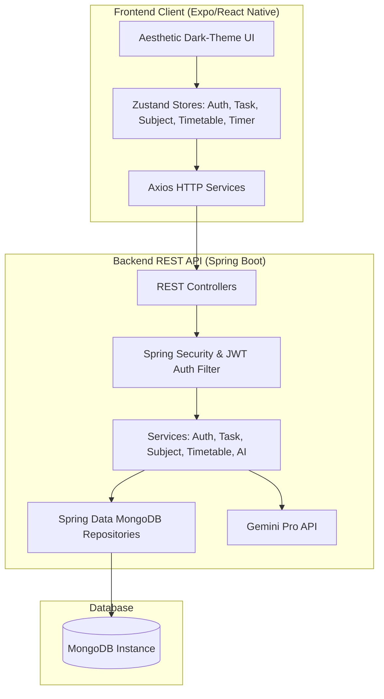

# 🌌 StudyNova — Smart Student Study Planner

[](LICENSE)
[](https://reactnative.dev/)
[](https://spring.io/projects/spring-boot)
[](https://www.mongodb.com/)
[](https://www.docker.com/)
[](https://deepmind.google/technologies/gemini/)

StudyNova is a premium, state-of-the-art smart student study planner application designed to elevate the academic experience. Combining a stunning, highly immersive dark-theme interface with intelligent workload optimization powered by **Google Gemini Pro AI**, StudyNova acts as a complete command center for academic success.

---

## 🌟 Key Features

### 📊 Workload Command Center (Dashboard)
*   **Intuitive Overview**: A sleek single-page dashboard highlighting active tasks, course directories, daily class/study timetables, and recent performance indicators.
*   **Quick Action Hub**: Seamless navigation shortcuts to add tasks, register course subjects, log study hours, or activate the focus timer.

### 📝 Task Tracking System
*   **Granular Fields**: Log and manage study tasks complete with priority levels (High, Medium, Low), due dates, focus hour estimates, and customized local reminder offsets.
*   **Progress Tracking**: Mark tasks as in-progress or completed, automatically feeding into your performance analytics.

### 📚 Course Subjects Catalog
*   **Dynamic Directory**: Create, update, and manage your course subjects alongside custom color indicators and course codes.
*   **Cohesive Association**: Group task entries and weekly timetable blocks under specific course codes for simplified organization.

### 📅 Timetable & Schedule Organizer
*   **Weekly Calendar View**: Plan and track recurring classes, tutorials, and dedicated self-study blocks.
*   **Smart Reminders**: Automatically schedule local notifications to trigger before classes or self-study sessions commence.

### ⏱️ Pomodoro Focus Timer
*   **Immersive Focus Mode**: A beautiful full-screen Pomodoro timer (Focus, Short Break, and Long Break modes) built to keep you on-task.
*   **Automatic Logging**: Focus sessions completed are directly converted into study sessions and automatically saved to your timetable.

### 📈 Detailed Performance Analytics
*   **Study Time Trends**: Beautiful charts tracking your weekly study hours.
*   **Task Performance Ratios**: Interactive widgets illustrating high, medium, and low priority task completion statistics.

### 🤖 Gemini-Powered AI Study Advisor
*   **Custom Strategies**: An advanced prompt engine integrated with Gemini Pro that analyzes your current task list, timetable commitments, and priority levels.
*   **Tailored Action Plan**: Outputs a bespoke daily study timetable and execution strategy to help you beat academic overload.

### ⚙️ Advanced Settings & Profile
*   **Personalization**: Adjust your full name, change passwords securely, customize push notification settings (study reminders, deadline alerts, weekly digest, AI alerts), and submit support tickets directly.

---

## 🎨 Design & Aesthetic System
*   **Premium Dark UI**: Immersive dark mode layout featuring deep navy/charcoal backgrounds, neon purple accent highlights, and glassmorphic card layers.
*   **Harmonious Gradients**: Vibrant linear gradient backdrops providing premium visual cues and high engagement.
*   **Micro-interactions**: Smooth transitions, loading spinners, tactile feedback alerts, and interactive overlays.

---

## 🏗️ Architecture & Technology Stack

### Frontend Client
*   **Framework**: React Native & Expo SDK (supports iOS, Android, and Web)
*   **State Management**: Zustand (Clean, reactive, and stateless store architecture)
*   **Form & Validation**: React Hook Form with Yup schema integration
*   **Navigation**: React Navigation (Native Stack & Bottom Tabs)
*   **Animations & Visuals**: React Native Reanimated, Linear Gradients, and Gifted Charts
*   **Icons**: Ionicons vector package

### Backend REST API
*   **Framework**: Java Spring Boot 3.x (Java 17)
*   **Security & Auth**: Spring Security configured with stateless JWT authentication, password hashing, and token verification
*   **Database Interface**: Spring Data MongoDB
*   **AI Integration**: RestTemplate client querying Gemini Pro API endpoints
*   **Productivity**: Project Lombok (reduces boilerplate code)

### Database & Operations
*   **Primary Database**: MongoDB (NoSQL document storage optimized for highly extensible database schemas)
*   **Deployment**: Support for fully containerized multi-stage Docker builds running inside a bridged Docker network

---

## 📂 Project Architecture



---

## 🚀 Local Development Setup

### Option 1: Quick Launch via Docker Compose (Recommended)
Make sure you have [Docker](https://www.docker.com/) and [Docker Compose](https://docs.docker.com/compose/) installed on your machine.

1.  Clone this repository to your local directory.
2.  Open the `docker-compose.yml` file and configure your `GEMINI_API_KEY`:
    ```yaml
    environment:
      - GEMINI_API_KEY=your_actual_gemini_api_key
    ```
3.  Launch the entire stack from the root directory:
    ```bash
    docker-compose up --build -d
    ```
4.  The backend server will spin up on `http://localhost:8080` and a MongoDB instance will mount on `mongodb://localhost:27017/studentplanner`.

---

### Option 2: Manual Step-by-Step Installation

#### 1. Prerequisites
Ensure you have the following installed locally:
*   [Node.js](https://nodejs.org/) (v18+)
*   [Java Development Kit (JDK 17)](https://www.oracle.com/java/technologies/downloads/)
*   [Maven](https://maven.apache.org/download.cgi) (v3+)
*   [MongoDB](https://www.mongodb.com/try/download/community) (Local Server or MongoDB Atlas cloud URI)

#### 2. Backend Server Setup
1.  Navigate into the backend directory:
    ```bash
    cd backend
    ```
2.  Configure your environment variables inside a `.env` file (using `.env.example` as a template):
    ```env
    PORT=8080
    MONGO_URI=mongodb://localhost:27017/studentplanner
    JWT_SECRET=your_super_secure_jwt_secret_key_here
    GEMINI_API_KEY=your_gemini_api_key_here
    ```
3.  Install dependencies and build the artifact:
    ```bash
    mvn clean install
    ```
4.  Run the Spring Boot application:
    ```bash
    mvn clean spring-boot:run
    ```
    The server will run on `http://localhost:8080`.

#### 3. Frontend Client Setup
1.  Navigate to the frontend directory:
    ```bash
    cd ../frontend
    ```
2.  Create a `.env` file or configure your Expo API endpoint. Refer to `.env.example`:
    ```env
    EXPO_PUBLIC_API_BASE_URL=http://localhost:8080
    ```
    *   *Tip*: For local emulator testing on mobile devices, use your machine's local IP address (e.g. `http://192.168.x.x:8080`) instead of `localhost`.
3.  Install the required dependencies:
    ```bash
    npm install
    ```
4.  Launch the Expo development server:
    ```bash
    npm run start
    ```
    *   Press `a` to run on Android emulator.
    *   Press `i` to run on iOS simulator.
    *   Press `w` to launch the web client version in your browser.

---

## 🛡️ Security Best Practices
*   Sensitive secrets (MongoDB Atlas connection keys, API credentials, and JWT keys) must be loaded dynamically using the `.env` configuration file.
*   Default fallback properties in `application.properties` are configured for safe **local development** (`mongodb://localhost:27017/studentplanner`) to prevent exposing cloud credentials in git history.
*   Client-side authentication handles session logouts by discarding stored JWT keys immediately.

---

## 🧪 Testing & Verification
*   **Backend Unit Tests**: Verify services and controllers using Spring Boot Starter Test (JUnit 5 & Mockito):
    ```bash
    cd backend
    mvn test
    ```
*   **API Validation**: You can access endpoints using Postman or cURL. Common endpoints include:
    *   `POST /api/auth/register` (Register a new account)
    *   `POST /api/auth/login` (Obtain JWT token)
    *   `GET /api/tasks` (Access user-specific tasks)

---

## 📄 Copyright
© 2026 Isula Mihisara. All Rights Reserved.
